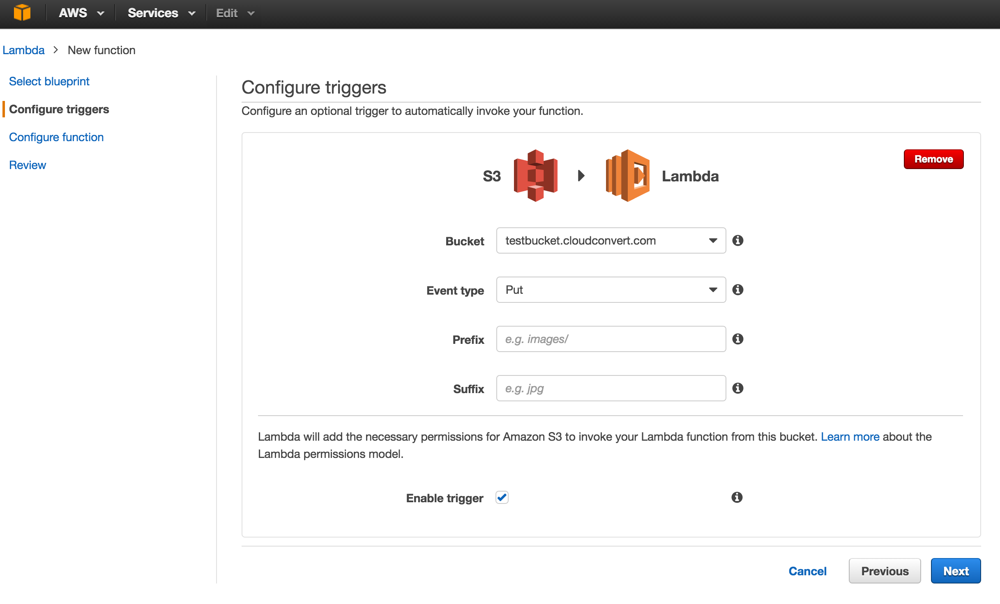
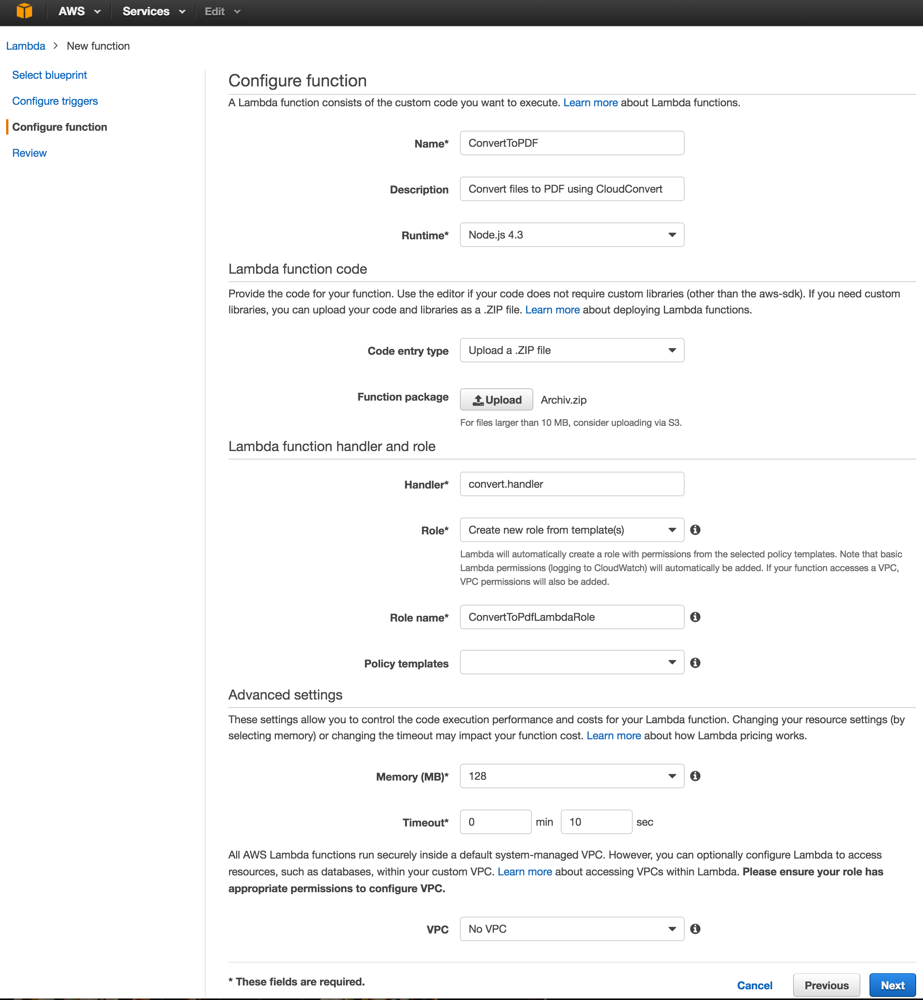

# AWS Lambda Example Function for the CloudConvert API

[AWS Lambda](https://aws.amazon.com/lambda/) is an event-driven compute service which runs your code (*Lambda functions*) in response to events, such as changes to data in an Amazon S3 bucket. In combination with the [CloudConvert API](https://cloudconvert.com/api) it is possible to automatically convert all files, added to a specific S3 bucket, to an output format.

This repository provides an example for such an Lambda function (`convert.js`). It can easily be adjusted and extended to specific use cases. 

## Setup Instructions

* Download / Fork this repository 
* Run `npm install`
* Adjust `convert.js` according to your needs:
    * Set `CLUDCONVERT_API_KEY` to your personal [API key](https://cloudconvert.com/user/profile).
    * Set `AWS_ACCESS_KEY_ID` and `AWS_SECRET_ACCESS_KEY` for downloading and uploading from/to your S3 bucket.  
    * Adjust the conversion paramaters, such as `outputformat` according to your need. All possible options can be identified using the [API Console](https://cloudconvert.com/api/console).
* Create a ZIP file which contains `convert.js` and the `node_modules` folder.
* In the AWS Console create a new Lambda function. Select *Blank Function* blueprint.
* Select S3 trigger and your bucket. Set *Event Type* to *PUT*. Adjust *Prefix* and *Suffix* to trigger for specific files only. 
* Choose a name for your Lambda function and use *Node.js 4.3* as Runtime. Upload your previously created ZIP file as Lambda function. The Handler name needs to be *convert.handler*. The lambda function does not need any specific permissions: you can create a new empty role. 
* A timeout value of 10 seconds should be sufficient. Please note that the lambda function only *triggers* the actual conversion and exists as soon as the conversion was started. Therefore the timeout does not affect the time needed for the actual conversion.
* Done! You can test your Lambda function by adding a new file to your S3 bucket.

## Resources

* [API Console](https://cloudconvert.com/api/console)
* [API Documentation](https://cloudconvert.com/api/conversions)
* [Conversion Types](https://cloudconvert.com/formats)
* [CloudConvert Blog](https://cloudconvert.com/blog)